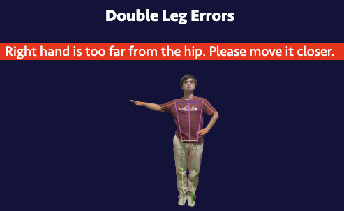

# Online Sport Concussion Assessment

An online sport concussion assessment for English speaking athletes across the world compliant with the international SCAT6 standard. Focused on helping student athletes in Washington, USA, the goal is to make concussion tests more accessible and remove some of the subjective nature of the tests. The tool also allows coaches to easily compare test results over time to make more informed decisions about player health. URL: [https://scat6-web.web.app/](https://scat6-web.web.app/)

**Contact**: scat6@sandergi.com

### Walkthrough Video

### Features
- CISG approved SCAT6 assessment with 16 assessed domains (memory, balance, coordination, orientation, delayed recall, etc.)
- Automatically sync data via your own Google Account (login via OAuth2)
- Works completely locally in the browser for maximum privacy and offline use
- Simple and easy to use UI to administer concussion tests, compare results over time/against baselines, and follow up with post injury assessments
- Automated Balance Error Scoring System (BESS) with 6 poses, implemented using Machine Learning with TensorFlow.js (pose detection, face landmark detection) and traditional computer vision techniques
- Lovely graphs and charts and extensive use of Web APIs (LocalStorage/SessionStorage, MediaDevices, Speech Recognition, Speech Synthesis, etc.)
- Standardized subjective tests with objective machine calculated results
- Cross platform compatibility and responsive design (works on desktop, tablet, and mobile)
- Export the full assessment results as CSV, PDF report, and traditional paper SCAT6 (without having to manually do the paper assessment)
- Free to use (for any amount of athletes) and open source

## Frequently Asked Questions (FAQ)

> How do I know if Google Drive Sync was successful?

If sync is successful, you should see the "Sync" button turn green, change text to "Synced", and display your linked Google Drive account photo:
 
You can click on the button to see details about when the data was last successfully synced with your Google Drive.

> When sync is enabled, where are documents saved in my Google Drive?

You won't find the data in your regular documents. It is instead stored in the app data which you can find in your Google Drive Settings by selecting "Administer Apps" and scrolling down until you see "Concussion Assessment (Unverified)" like this:
 
Make sure you are using the same account that you have linked with the SCAT6 Web Tool.

If you want to delete the data, you could do it from here in the Google Drive Settings. However it is recommended to do it from the SCAT6 Web Tool (by clicking on the green "Synced" button and selecting to delete drive data) to make sure nothing gets corrupted and everything is fully deleted. The data synced to Google Drive is encrypted. This means you won't be able to view individual test data from Google Drive.

> Is it correctly understood that data will only be stored on my computer/synced with Google Drive and not be sent to a third party?

Yes, all information stays locally on your computer, no third parties.

If you choose to activate "Sync", data will also be saved on your personal Google Drive. Access to your Google Drive remains local, so there is no risk of it being compromised. Due to the way syncing with Google Drive works, we do have to track a list of Gmails using "Sync" and when they have last saved data. This list is never shared with third parties.

> Is data stored permanently if I don't sync with Google Drive?

In most scenarious, yes. However it is still recommended to activate Google Drive sync to be on the safe side. It happens rarely, but depending on your browser settings, the browser may force the Web App to delete the local copy of data if your device runs out of memory. There is also the chance of loosing your device or it getting damaged. An alternative solution, if you prefer not to use Google Drive, would be to "Export" each test after completing it to save its information somewhere else.

> I have found a bug, have an idea for improvements, or want to get involved in making this tool better. How can I help?

Feel free to reach out to scat6@sandergi.com or [post an issue here on GitHub](https://github.com/SanderGi/ConcussionAssessment/issues). We also have [a feedback form](https://docs.google.com/forms/d/e/1FAIpQLSdBolyOESnMwdJW6ONJ-8MLbwcpHxQsrV5nChIqOiDfMF6YgQ/viewform?usp=dialog) you can fill out.

### Screenshots

## Development

Run `npm install -g firebase-tools` to install the Firebase CLI.

Run `firebase serve` to run the development server locally.

Run `firebase deploy` to deploy the project to Firebase.

## Sources
- [SCAT6 Instructions](https://www.sportsconcussion.co.za/sportconcussion/wp-content/uploads/2023/07/SCAT6-Instructions-v9.pdf)
- [SCAT6 Assessment](https://bjsm.bmj.com/content/bjsports/57/11/622.full.pdf)
- [BESS Manual](https://atriumhealth.org/documents/carolinasrehab/bess_manual_.pdf)
- [BESS and Gait Study](https://www.ncbi.nlm.nih.gov/pmc/articles/PMC7987555/)
- [Immediate and Delayed Recall Study](https://www.ncbi.nlm.nih.gov/pmc/articles/PMC6109942/)
- [Symptom Severity Study](https://www.ncbi.nlm.nih.gov/pmc/articles/PMC8583872/)
- [SCAT6 Results Study](https://www.ncbi.nlm.nih.gov/pmc/articles/PMC6326330/)
- [Google Fonts](https://fonts.google.com/icons)
- [Font Awesome](https://fontawesome.com/search)

## Contributors

As Software Engineer, I was responsible for translating the paper SCAT6 into web format, designing the UI/UX, and coding the web application. As a researcher, I took a lead on designing the associated study and writing the paper.

My collaborator, Aureole had the original idea to create a digital version of the international SCAT6. She took the lead on user testing and coordinating approval of the application with CISG. She is also working to expand the current assessment by researching additional objective neurocognitive test modules. As a student athlete herself, Aureole has been researching and advocating for better concussion testing standards and updated RTL/RTS guidelines on a state and national level for many years.

## License

The SCAT6 content itself is not mine to license, but the code is licensed under the [MIT License](./LICENSE).
