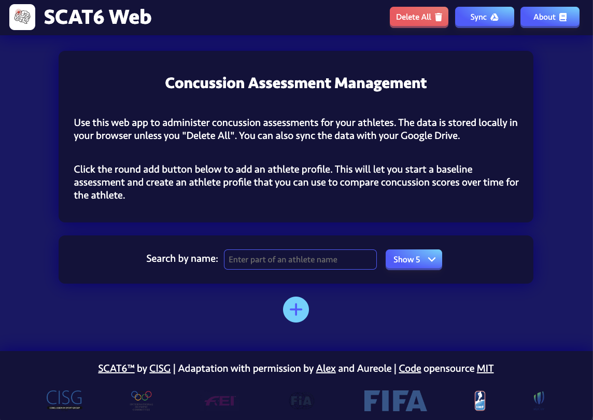

# Online Sport Concussion Assessment

An online sport concussion assessment for English speaking athletes across the world compliant with the international SCAT6 standard. Focused on helping student athletes in Washington, USA, the goal is to make concussion tests more accessible and remove some of the subjective nature of the tests. The tool also allows coaches to easily compare test results over time to make more informed decisions about player health. URL: [https://scat6-web.web.app/](https://scat6-web.web.app/)

**Contact**: scat6@sandergi.com

### Walkthrough Video

### Features
- CISG approved SCAT6 assessment with 16 assessed domains (memory, balance, coordination, orientation, delayed recall, etc.)
- Automatically sync data via your own Google Account (login via OAuth2)
- Works completely locally in the browser for maximum privacy and offline use
- Simple and easy to use UI to administer concussion tests, compare results over time/against baselines, and follow up with post injury assessments
- Automated Balance Error Scoring System (BESS) with 6 poses, implemented using Machine Learning with TensorFlow.js (pose detection, face landmark detection) and traditional computer vision techniques
- Lovely graphs and charts and extensive use of Web APIs (LocalStorage/SessionStorage, MediaDevices, Speech Recognition, Speech Synthesis, etc.)
- Standardized subjective tests with objective machine calculated results
- Cross platform compatibility and responsive design (works on desktop, tablet, and mobile)
- Export the full assessment results as CSV, PDF report, and traditional paper SCAT6 (without having to manually do the paper assessment)
- Free to use (for any amount of athletes) and open source

### Screenshots

## Development

Run `npm install -g firebase-tools` to install the Firebase CLI.

Run `firebase serve` to run the development server locally.

Run `firebase deploy` to deploy the project to Firebase.

## Sources
- [SCAT6 Instructions](https://www.sportsconcussion.co.za/sportconcussion/wp-content/uploads/2023/07/SCAT6-Instructions-v9.pdf)
- [SCAT6 Assessment](https://bjsm.bmj.com/content/bjsports/57/11/622.full.pdf)
- [BESS Manual](https://atriumhealth.org/documents/carolinasrehab/bess_manual_.pdf)
- [BESS and Gait Study](https://www.ncbi.nlm.nih.gov/pmc/articles/PMC7987555/)
- [Immediate and Delayed Recall Study](https://www.ncbi.nlm.nih.gov/pmc/articles/PMC6109942/)
- [Symptom Severity Study](https://www.ncbi.nlm.nih.gov/pmc/articles/PMC8583872/)
- [SCAT6 Results Study](https://www.ncbi.nlm.nih.gov/pmc/articles/PMC6326330/)
- [Google Fonts](https://fonts.google.com/icons)
- [Font Awesome](https://fontawesome.com/search)

## Contributors

As Software Engineer, I was responsible for translating the paper SCAT6 into web format, designing the UI/UX, and coding the web application. As a researcher, I took a lead on designing the associated study and writing the paper.

My collaborator, Aureole had the original idea to create a digital version of the international SCAT6. She took the lead on user testing and coordinating approval of the application with CISG. She is also working to expand the current assessment by researching additional objective neurocognitive test modules. As a student athlete herself, Aureole has been researching and advocating for better concussion testing standards and updated RTL/RTS guidelines on a state and national level for many years.

## License

The SCAT6 content itself is not mine to license, but the code is licensed under the [MIT License](./LICENSE).
